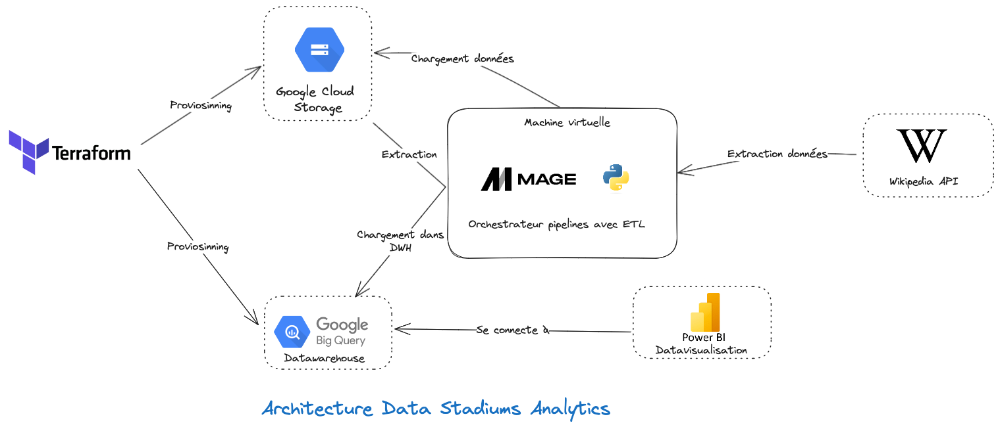

## World Stadiums End to End Data Project

This is an Data Engineering End to End project. The goal is to extract world stadiums data from wikipedia and analyze them with a Business Intelligence tool.  

Tools used:  

<!-- -- Tools : Terraform, Python, Mage, Cloud Storage, Big Query and Power BI  
-- Extract data from Wikipedia with Python  
-- Transform with Python  
-- Load data to Big Query   -->
### Data Architecture

### How to run this project
#### Prerequisities
    - A Google Cloud Platform account  
    - Terraform installed locally  
    - Mage installed on a VM or locally  
    - Python
    - Power BI
    - And some motivation  

You'll find all the python packages used in the requirements.txt file

1- Create a service account in GCP and generate keys. Save the keys in a folder named `keys` in the project. Rename the file name as `football-gcp-credentials.json`  
2- [Optionnal] You can change the name of the bucket, specify a region or change the name of the Big Query dataset  in `variables.tf`
3- Terraform run:  
    - Run `terraform plan` to see the provisionning plan   
    - Run `terraform apply` to create `Cloud Storage` bukcet and `Big Query dataset and table`  
    - When you're done with the project, run `terraform destroy` to delete all the ressources  

<!-- SQL Queries :   
-- top 5 stadiums by capacity --  
-- average capacity by region --  
-- count of stadiums in each country--  
-- stadium ranking within each region--  
-- top 3 stadium ranking within each region--  
-- stadiums with capacity above average --  
-- stadiums with the closest capacity to regional median--   -->
